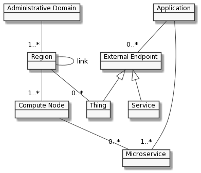
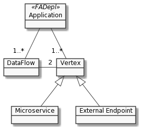
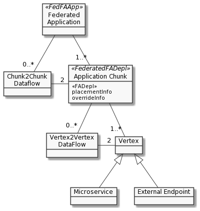

# CRD-client-go

crd-client-go defines and implements the custom types used by FogAtlas in terms of
k8s Custom Resource Definition (CRD). Once defined the types, it generates the corresponding
API using k8s code generator (see below).

## FogAtlas CRDs definition and API

Types in FogAtlas are defined starting from the following domain models: the first one models
a distributed infrastructure while the second models an application as a graph of vertices (microservices)
and edges (dataflows).


*infrastructure model*


*application model*


*federated application model*

From these models the CRD definition are derived.

In the folder `crd_definitions` you can find (in yaml format) the CRDs that extend the k8s resources:
* _fogatlas.fbk.eu_dynamicnode.yaml_: used only by the provisioning phase. Currently not used.
* _fogatlas.fbk.eu_externalendpoint.yaml_: defines an external endpoint (sensor, camera or external service).
* _fogatlas.fbk.eu_fadepl.yaml_: defines a so called FogAtlas deployment (FADepl) that models a cloud native application.
* _fogatlas.fbk.eu_fedfaapp.yaml_: extension of FADepl for federated multi-clusters. Not used at the moment.
* _fogatlas.fbk.eu_region.yaml_: defines a region interconnected by a Link.
* _fogatlas.fbk.eu_link.yaml_: defines a network link between two Regions.

The file [_types.go_](pkg/apis/fogatlas/v1alpha1/types.go) defines programmatically the aforementioned CRDs.

## How to define or change CRDs
1. Write/Update these three files in `pkg/apis/<api-group>/v1alpha1`
   * _doc.go_ where global generation tags are defined
   * _types.go_ where custom types are defined
   * _register.go_ where custom types are registered to the k8s API
2. Use `./hack/update-codegen.sh` script to generate the code. This step needs:
   ```sh
   go get k8s.io/code-generator
   go get k8s.io/apimachinery
   ```
3. Use `./hack/gen_crd.sh` to generate the corresponding crd. This step needs:
   ```sh
   go get sigs.k8s.io/controller-tools/cmd/controller-gen
   ```  
The steps 1-3 can be executed with a convenient Makefile tag.

## How to install CRDs

In order to install the defined CRD on a k8s cluster, just do the following:
```sh
cd crd-definitions
kubectl apply -f fogatlas.fbk.eu_region.yaml
kubectl apply -f fogatlas.fbk.eu_link.yaml
kubectl apply -f fogatlas.fbk.eu_externalendpoint.yaml
kubectl apply -f fogatlas.fbk.eu_fadepl.yaml
kubectl apply -f fogatlas.fbk.eu_ffedfaapp.yaml
```

## License

Copyright 2019 FBK CREATE-NET

Licensed under the Apache License, Version 2.0 (the “License”); you may not use this
file except in compliance with the License. You may obtain a copy of the License
[here](http://www.apache.org/licenses/LICENSE-2.0).

Unless required by applicable law or agreed to in writing, software distributed under
the License is distributed on an “AS IS” BASIS, WITHOUT WARRANTIES OR CONDITIONS OF ANY KIND,
either express or implied. See the License for the specific language governing permissions
and limitations under the License.

